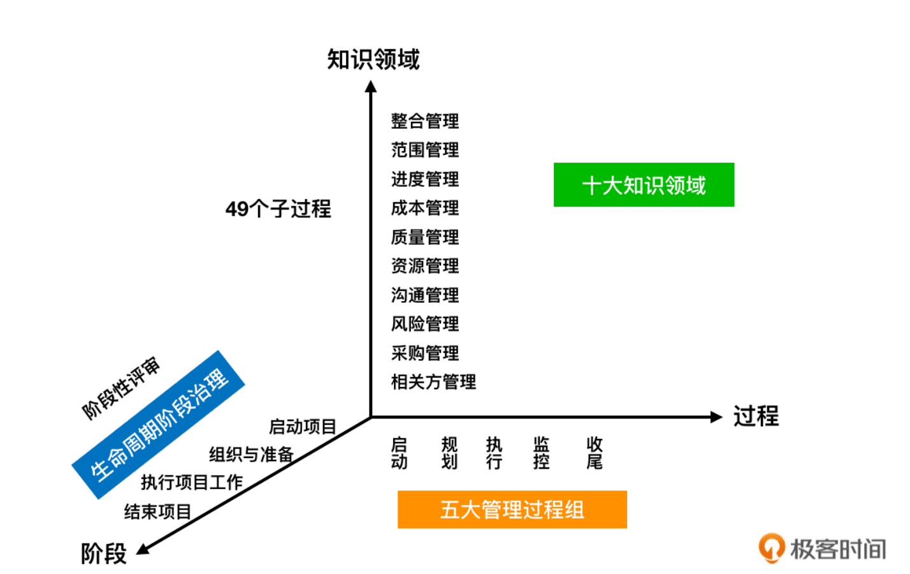
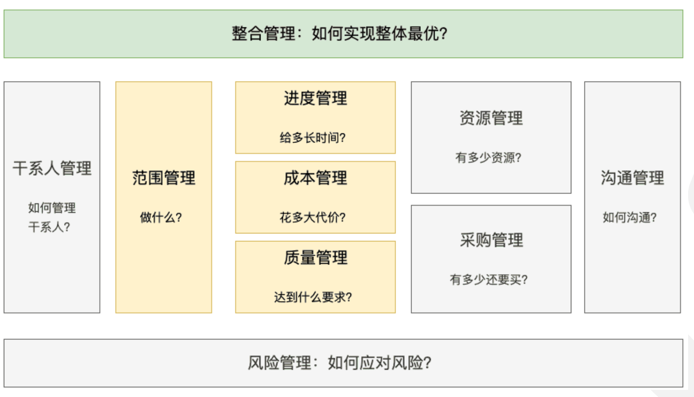
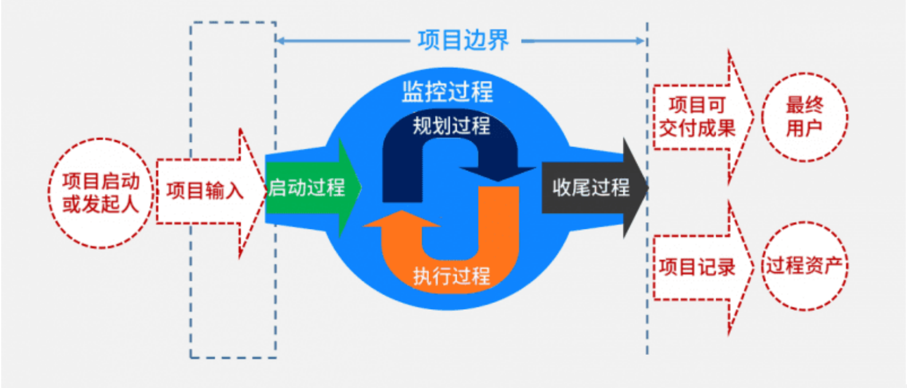
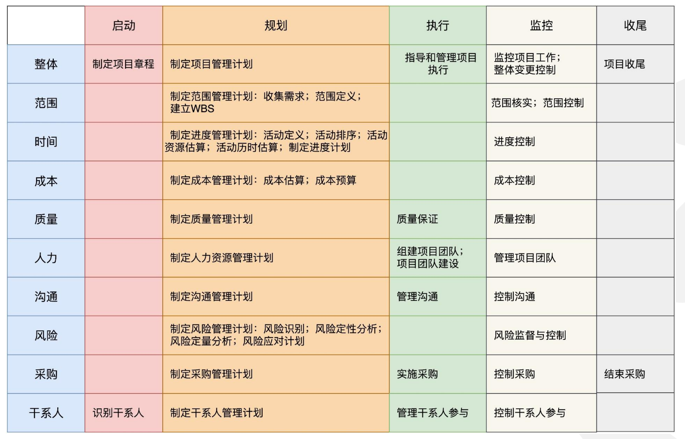

### 概述
- 项目管理就是将各种知识、技能、工具与技术应用于项目活动，以满足项目的要求。——《项目管理知识体系指南》
- 由于项目管理的知识体系过于庞大，PMI 把它分为项目管理五大过程组和十大知识领域，共 49 个子过程。

### 项目管理十大领域划分
- 项目管理的十大领域，将项目管理的工作内容划分为：整合管理、范围管理、时间管理、成本管理、质量管理、人力资源管理、沟通管理、干系人管理、风险管理和采购管理。
- 其中，进度、成本、质量、范围是 4 个核心领域，风险、沟通、采购、资源、干系人管理是 5 个辅助领域和 1 个整体领域。

### 项目管理五大过程组
- 项目管理五大过程组，是项目管理的核心内容，是项目管理的四个核心领域的集合。
- PMI 遵循`PDCA`的法则，将所有的项目管理活动分成了五大过程组，分别是**启动过程组**、**规划过程组**、**执行过程组**、**监控过程组**和**收尾过程组**。如下图所示：

- 启动过程组（千里之行，始于足下）
  - 启动过程组意味着正式开始一个项目，或者是开始一个项目中的新阶段，包括识别干系人和制定项目章程两个子过程。
- 规划过程组（运筹帷幄，决胜千里）
  - 你需要根据预期目标，明确项目范围，确定项目的里程碑阶段目标，为项目的执行做好各项准备。
- 执行过程组（言出必行，行之必果）
  - 这个阶段重在整合资源，推进项目落地，完成项目管理计划中确定的工作以实现项目目标。
- 监控过程组（审时度势，沉着应变）
  - 你需要定期对项目的进展、范围、质量等进行跟踪和监控，识别目前的进度与计划之间的偏差，从而快速准确地采取办法进行纠正和调整。
- 收尾过程组（慎终如始，则无败事）
  - 在这个阶段，你要交付项目成果，组织团队的回顾复盘，归档所有文档等组织过程资产，正式结束一个项目或阶段。

### 项目管理五大过程组的工作内容
